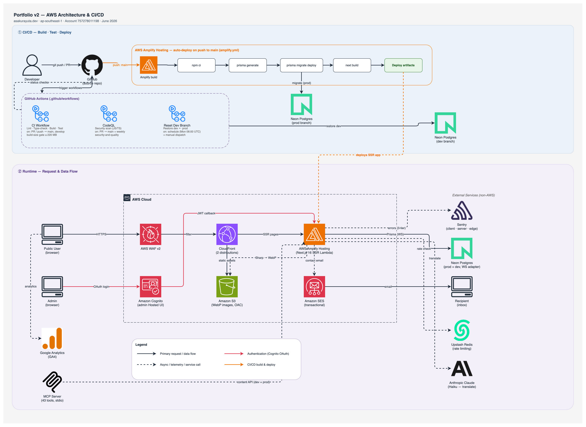

# Portfolio v2

> Full-stack personal portfolio and headless CMS — Next.js 16 App Router, Prisma + Neon Postgres, AWS Amplify, bilingual EN/JA via Claude Haiku, and a 43-tool MCP server.

[](https://github.com/yutaasakura96/portfolio-v2/actions/workflows/ci.yml)


**Live demo:** [asakurayuta.dev](https://asakurayuta.dev)

---


---

## Highlights

| Feature                    | Detail                                                                                                                                                                                                       |
| -------------------------- | ------------------------------------------------------------------------------------------------------------------------------------------------------------------------------------------------------------ |
| **GLSL 3D hero blob**      | Morphing WebGL shader rendered with `@react-three/fiber`; mouse-reactive; gracefully falls back on old mobile browsers via `WebGLErrorBoundary`                                                              |
| **DB-driven EN / JA i18n** | Full bilingual content (EN + JA) stored as `*Ja` columns in Postgres; locale toggled in the header with `localStorage` persistence; static UI strings translated via Claude Haiku with prompt caching        |
| **43-tool MCP server**     | A local portfolio MCP server exposes every content entity (projects, blog, skills, experience, education, certifications, messages, hero, settings) as callable tools — readable by any MCP-compatible agent |
| **AI cert extraction**     | Uploading a certification image calls `/api/admin/certifications/extract`; Claude Haiku's vision capability auto-fills name, issuer, dates, and credential ID                                                |
| **Dual Neon branches**     | `production` and `dev` Neon branches run completely separate data; migrations are applied per-branch; the dev branch can be reset from production with a single script                                       |
| **Full admin CMS**         | Auth-guarded at `/admin` via AWS Cognito + HTTP-only JWT cookies; covers every content entity with drag-to-reorder, markdown editor, unified JSON import/export, and translation management                  |

---

## Tech Stack

Next.js 16 · React 19 · TypeScript 5 (strict) · Prisma 7 + Neon Postgres · TailwindCSS 4 · shadcn / Radix UI · TanStack Query 5 · react-hook-form + Zod 4 · AWS Cognito · AWS Amplify Hosting (SSR) · S3 + CloudFront · SES · `@react-three/fiber` + Three.js · Sharp (WebP) · Sentry · Upstash Redis (rate limiting) · Vitest + Testing Library · Sonner · Geist

Full rationale and version table → [docs/tech-stack.md](docs/tech-stack.md)

---

## Architecture at a Glance



The public site is served via **AWS Amplify Hosting Gen 1** (SSR) with CloudFront in front of S3-stored assets. **Neon Postgres** is accessed from Lambda via the WebSocket `PrismaNeon` adapter. Auth flows through **AWS Cognito** (Hosted UI → OAuth code exchange → HTTP-only cookies). SES handles transactional email from the contact form.

Full architecture reference, directory structure, route groups, and data-layer rules → [docs/architecture.md](docs/architecture.md)

---

## Quick Start

> A full run requires your own AWS account (Amplify, Cognito, S3, CloudFront, SES), a Neon Postgres project, and an Upstash Redis instance. See [docs/setup.md](docs/setup.md) for the complete environment-variable reference.

```bash
# 1. Clone the repository
git clone https://github.com/yutaasakura96/portfolio-v2.git
cd portfolio-v2

# 2. Install dependencies
npm install

# 3. Create your local environment file and fill in all required values
cp .env.example .env

# 4. Generate the Prisma client and apply migrations to your dev Neon branch
npm run prisma:generate
npm run prisma:migrate:dev

# 5. Start the development server
npm run dev
# → http://localhost:3000
```

The admin panel is at `/admin`. Sign in via the Cognito Hosted UI.

---

## Documentation

| Doc                                            | Description                                                                                       |
| ---------------------------------------------- | ------------------------------------------------------------------------------------------------- |
| [docs/setup.md](docs/setup.md)                 | Prerequisites, all environment variables, local setup, database workflow, and available scripts   |
| [docs/architecture.md](docs/architecture.md)   | Directory structure, route groups, rendering model, data layer, dual-branch DB, and diagram links |
| [docs/tech-stack.md](docs/tech-stack.md)       | Technology choices with rationale, Amplify build pipeline, and AWS topology                       |
| [docs/features.md](docs/features.md)           | Public site and admin CMS feature inventory with screenshots                                      |
| [docs/api-reference.md](docs/api-reference.md) | Every HTTP endpoint, conventions, auth helpers, import/export routes, and MCP server tool surface |

---

## Project Structure

```
portfolio-v2/
├── src/
│   ├── app/
│   │   ├── (public)/          # Public-facing pages (ISR, Server Components by default)
│   │   ├── (admin)/admin/     # Auth-guarded CMS shell
│   │   └── api/               # REST API routes (entity CRUD, auth, upload, translate…)
│   ├── components/
│   │   ├── ui/                # shadcn primitives
│   │   ├── shared/            # Shared across public + admin
│   │   ├── public/            # Public-only components
│   │   └── admin/             # Admin-only components
│   ├── lib/
│   │   ├── data/              # Server-side query layer + canonical types
│   │   ├── validations/       # Zod schemas (one file per entity)
│   │   └── i18n.ts            # t(), tArray(), tJson(), ui(), UI_STRINGS
│   └── proxy.ts               # JWT middleware guard for /admin routes
├── prisma/
│   └── schema.prisma          # Single schema, dual Neon branches
├── mcp/portfolio-server/      # 43-tool MCP server (stdio transport)
├── docs/                      # Architecture docs, API reference, diagrams, screenshots
├── amplify.yml                # Amplify build pipeline
└── customHttp.yml             # Security response headers (HSTS, CSP, X-Frame-Options…)
```

---

## License / Contact

Private — all rights reserved.

Author: **Yuta Asakura** — [asakurayuta.dev](https://asakurayuta.dev) · [GitHub](https://github.com/yutaasakura96)
