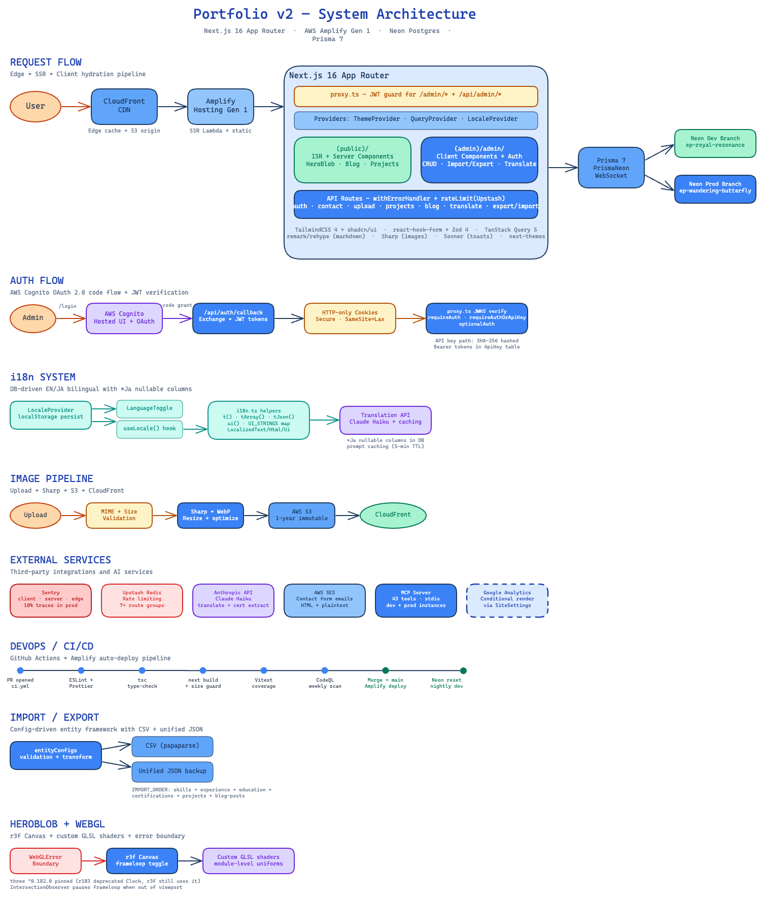
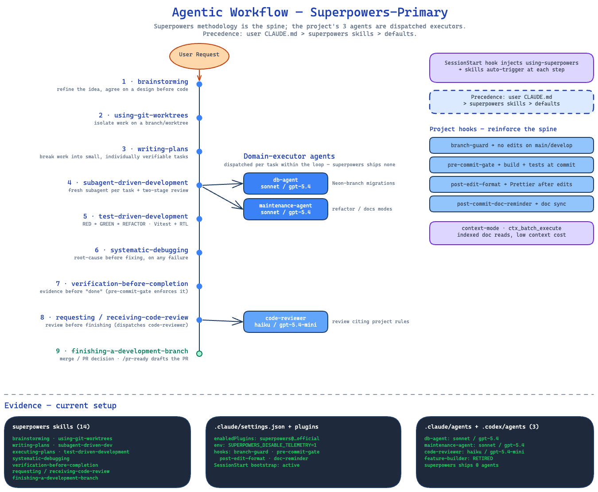

# Architecture

This portfolio is a Next.js 16 App Router application combining a publicly accessible ISR site with an
auth-guarded admin CMS backed by Neon Postgres via Prisma. The two surfaces share a single codebase
and are deployed together to AWS Amplify Hosting (Gen 1 SSR), with separate Neon branches for
production and development.

---

## Directory structure

```
portfolio-v2/
├── prisma/                    Prisma schema, migrations, and seed script
│   └── schema.prisma          12 models (Hero, Project, BlogPost, Skill, Experience, …)
├── src/
│   ├── proxy.ts               Next.js 16 middleware replacement — JWT guard for /admin
│   ├── app/
│   │   ├── (public)/          Public site — ISR, Server Components by default
│   │   │   ├── page.tsx       Home (/)
│   │   │   ├── about/         /about
│   │   │   ├── blog/          /blog and /blog/[slug]
│   │   │   ├── contact/       /contact
│   │   │   └── projects/      /projects and /projects/[slug]
│   │   ├── (admin)/
│   │   │   └── admin/
│   │   │       ├── login/     /admin/login (public, exempt from JWT guard)
│   │   │       └── (shell)/   Auth-guarded CMS shell (layout + all admin pages)
│   │   │           ├── page.tsx          /admin (dashboard)
│   │   │           ├── hero/             /admin/hero
│   │   │           ├── projects/         /admin/projects, /admin/projects/new, /admin/projects/[id]/edit
│   │   │           ├── blog/             /admin/blog, /admin/blog/new, /admin/blog/[id]/edit
│   │   │           ├── experience/       /admin/experience, …/new, …/[id]/edit
│   │   │           ├── education/        /admin/education, …/new, …/[id]/edit
│   │   │           ├── skills/           /admin/skills
│   │   │           ├── certifications/   /admin/certifications
│   │   │           ├── about/            /admin/about
│   │   │           ├── messages/         /admin/messages
│   │   │           ├── settings/         /admin/settings
│   │   │           ├── translations/     /admin/translations (EN→JA workflow)
│   │   │           └── import/           /admin/import (unified JSON restore)
│   │   └── api/               REST API — all routes wrapped in withErrorHandler
│   │       ├── auth/          OAuth callback, token refresh, me, signout
│   │       ├── contact/       Public contact-form submission (rate-limited, SES)
│   │       ├── health/        Site health check
│   │       ├── upload/        S3 image upload (Sharp → WebP → CloudFront)
│   │       ├── resume/        Resume PDF download
│   │       ├── hero/          CRUD + export/import
│   │       ├── projects/      CRUD + reorder + export/import
│   │       ├── blog/          CRUD + export/import
│   │       ├── experience/    CRUD + reorder + export/import
│   │       ├── education/     CRUD + reorder + export/import
│   │       ├── skills/        CRUD + reorder + export/import
│   │       ├── skill-categories/ CRUD + reorder
│   │       ├── certifications/ CRUD + reorder + export/import + AI extraction
│   │       ├── messages/      List, read, archive, bulk-update (no delete)
│   │       ├── about/         Singleton CRUD + export/import
│   │       ├── settings/      Singleton CRUD + export/import
│   │       └── admin/         Admin-only: api-keys, dashboard-stats, dashboard-external,
│   │                          unified export/import, translate (Claude Haiku)
│   ├── components/
│   │   ├── ui/                shadcn/Radix primitives (do not hand-edit; use CLI)
│   │   ├── public/            Public-site-only React components (ContactForm, hero, etc.)
│   │   ├── admin/             Admin-only components (forms, dashboard cards, sidebar)
│   │   ├── shared/            Components used across both surfaces (ThemeToggle, LanguageToggle)
│   │   └── providers/         Context providers (LocaleProvider, QueryClientProvider, ThemeProvider)
│   ├── hooks/                 Client-side React hooks (use-locale, use-auth, use-dashboard-*, …)
│   ├── lib/
│   │   ├── data/              Server-side query layer (public-queries.ts, types.ts, db-resilience.ts)
│   │   ├── validations/       Zod 4 schemas — one file per entity
│   │   ├── import-export/     CSV/JSON helpers and entity configs for bulk backup/restore
│   │   ├── aws/               AWS SDK wrappers (S3, SES, Amplify)
│   │   └── utils/             Shared utilities (cn, rate-limit, markdown, i18n, locale, …)
│   └── test/                  Shared test factories
├── mcp/
│   └── portfolio-server/      Stdio MCP server — 43 tools proxying the Next.js API
├── scripts/                   Dev utilities (mcp-setup, neon-reset-dev)
├── docs/
│   ├── architecture.md        ← this file
│   ├── diagrams/              Architecture and AWS diagrams (Excalidraw + draw.io + PNG)
│   └── screenshots/           Static PNG screenshots (public + admin, 1440×900)
└── .claude/                   Claude Code hooks, rules, docs, and agent definitions
```

---

## Route groups

### Public routes

| Path               | Page                                              |
| ------------------ | ------------------------------------------------- |
| `/`                | Home — hero, featured projects, recent blog posts |
| `/about`           | About page                                        |
| `/blog`            | Blog index                                        |
| `/blog/[slug]`     | Blog post detail                                  |
| `/contact`         | Contact form                                      |
| `/projects`        | Projects index                                    |
| `/projects/[slug]` | Project detail                                    |

### Admin routes (all require valid Cognito JWT except `/admin/login`)

| Path                          | Page                                           |
| ----------------------------- | ---------------------------------------------- |
| `/admin/login`                | Cognito Hosted UI redirect (exempt from guard) |
| `/admin`                      | Dashboard                                      |
| `/admin/hero`                 | Hero section editor                            |
| `/admin/projects`             | Projects list                                  |
| `/admin/projects/new`         | New project form                               |
| `/admin/projects/[id]/edit`   | Edit project                                   |
| `/admin/blog`                 | Blog post list                                 |
| `/admin/blog/new`             | New post form                                  |
| `/admin/blog/[id]/edit`       | Edit post                                      |
| `/admin/experience`           | Experience list + editor                       |
| `/admin/experience/new`       | New entry                                      |
| `/admin/experience/[id]/edit` | Edit entry                                     |
| `/admin/education`            | Education list + editor                        |
| `/admin/education/new`        | New entry                                      |
| `/admin/education/[id]/edit`  | Edit entry                                     |
| `/admin/skills`               | Skills manager                                 |
| `/admin/certifications`       | Certifications manager                         |
| `/admin/about`                | About page content                             |
| `/admin/messages`             | Inbox (read/archive only)                      |
| `/admin/settings`             | Site settings                                  |
| `/admin/translations`         | EN→JA translation workflow                     |
| `/admin/import`               | Unified JSON restore                           |

> API methods and authentication details for each `/api/*` endpoint are documented in `api-reference.md`.

---

## Request / rendering model

```
Browser request
      │
      ▼
 src/proxy.ts  ──── /admin/* (not /admin/login, not /api/auth/*) ───► JWT verify (Cognito JWKS)
      │                                                                        │
      │                                                            invalid ────► redirect /admin/login
      │                                                            valid  ────► continue
      ▼
Next.js App Router
      │
      ├── (public)/*  ──► Server Components (ISR, revalidate per page)
      │                       └── data fetched via src/lib/data/public-queries.ts only
      │                               └── ISR-critical queries: withDbRetry (rethrows on failure)
      │                               └── Non-critical queries: try/catch → degrade to []
      │
      └── (admin)/*   ──► Server Components for layout + page shell
                              └── Client islands ("use client") use TanStack Query
                                      └── fetches via apiClient → /api/* routes
```

**Key rules:**

- Public pages are **Server Components by default**, using ISR (`revalidate` set per page). Client interactivity is isolated to leaf-level `"use client"` islands.
- The middleware replacement (`src/proxy.ts`) runs on the Edge. It reads the `access_token` HTTP-only cookie and verifies it against the Cognito JWKS endpoint. An invalid or missing token redirects to `/admin/login?redirect=<path>`.
- Admin pages authenticate server-side mutations through `requireAuth()` (browser sessions) or `requireAuthOrApiKey()` (MCP/API-key access) imported from `src/app/api/auth.ts`.
- Client-side data fetching in admin pages goes exclusively through `apiClient` (from `@/lib/api-client`) wrapped in TanStack Query hooks — never bare `fetch`.

---

## Data layer

All public Server Component data fetching is funneled through a single module:
`src/lib/data/public-queries.ts`.

**Canonical types** live in `src/lib/data/types.ts` (re-exports and narrows from Prisma generated
types). The `src/types/` directory is deprecated — do not add to it; import from `@/lib/data/types`
instead.

**ISR safety via `withDbRetry`:**

```
                    ┌─────────────────────────────────────────┐
                    │  withDbRetry(fn, label)                 │
                    │  src/lib/data/db-resilience.ts          │
                    │                                         │
                    │  • up to 4 retries with exponential     │
                    │    back-off (250 ms – 2 000 ms)         │
                    │  • retries: "fetch failed", ECONNRESET, │
                    │    connection-reset (Neon cold-start)   │
                    │  • non-retryable errors fail fast       │
                    │  • on exhaustion: Sentry.captureException│
                    │    then RETHROW (never swallow)         │
                    └─────────────────────────────────────────┘
```

Two distinct query patterns exist in `public-queries.ts`:

| Pattern                 | Used for                                                                        | On DB failure                                                      |
| ----------------------- | ------------------------------------------------------------------------------- | ------------------------------------------------------------------ |
| `withDbRetry(...)`      | ISR-critical homepage data (`getHero`, `getFeaturedProjects`, `getRecentPosts`) | **Rethrows** → ISR render aborts → Next.js serves last cached page |
| `try/catch → return []` | Non-critical lists (`getPublishedProjects`, `getPublishedPosts`)                | Returns empty array → page renders without that section            |

The rethrow pattern ensures a transient Neon cold-start cannot be cached as a permanently empty
homepage. The degrade-to-empty pattern is acceptable for secondary content where a temporarily empty
list is preferable to an aborted render.

---

## Dual database

The project uses two separate Neon Postgres branches with entirely separate data:

| Branch       | Endpoint prefix          | Used by                                               |
| ------------ | ------------------------ | ----------------------------------------------------- |
| `production` | `ep-wandering-butterfly` | AWS Amplify Hosting (live site at `asakurayuta.dev`)  |
| `dev`        | `ep-royal-resonance`     | `localhost:3000`, `npm run dev`, MCP portfolio server |

**How credentials are wired:**

- `.env` `DATABASE_URL` points at the **dev** branch. This is the default for all local work.
- Production credentials live exclusively in **Amplify Console environment variables** and are injected at build time via `amplify.yml` into `.env.production`. They never appear in the repository.

**Implications:**

- Content changes made via `localhost:3000` or the `portfolio` MCP tools (`mcp__portfolio__*`) affect only the **dev** database. They are invisible on the live site.
- To read or write **production** content, use the `portfolio-prod` MCP tools (`mcp__portfolio-prod__*`), which target `https://asakurayuta.dev`. Mutations via these tools affect the live site immediately.
- Running `prisma migrate dev` against `.env` (dev branch) does not migrate the production branch. Production migrations are applied via `prisma migrate deploy` in the Amplify build pipeline.

---

## Diagrams

### AWS infrastructure


The draw.io source is at [`docs/diagrams/aws-architecture.drawio`](diagrams/aws-architecture.drawio).
A written description of the topology is in [`docs/diagrams/aws-architecture.md`](diagrams/aws-architecture.md).

### Application architecture

The request, rendering, and data-flow pipeline — Edge → SSR → client hydration, the `proxy.ts`
JWT guard, the public/admin split, and the dual Neon branches:



Editable source: [`docs/diagrams/architecture.excalidraw`](diagrams/architecture.excalidraw)
(open in [excalidraw.com](https://excalidraw.com) or the VS Code Excalidraw extension).

### Agentic development workflow

How changes are built: the superpowers methodology is the spine (brainstorm → plan →
subagent-driven development → TDD → verification → review → finish), and the project's three
domain-executor agents (`db-agent`, `maintenance-agent`, `code-reviewer`) are dispatched per task
within that loop:



Editable source: [`docs/diagrams/agentic-workflow.excalidraw`](diagrams/agentic-workflow.excalidraw).
