# Features

This document catalogs what the public site and admin CMS can do, illustrated with
screenshots. It does not duplicate the API endpoint tables (see `api-reference.md`),
environment setup (see `setup.md`), or technology rationale (see `tech-stack.md`).

---

## Features

### [Public site](#public-site) {#public-site}

The public site is a Next.js App Router application rendered with Server Components by
default. Interactive widgets (hero blob, language toggle, project/blog browser, contact
form, image gallery, table of contents) are Client Components loaded where needed.

---

#### Hero section with interactive 3D blob

The landing page opens with a hero section that includes a headline, subheadline, bio,
configurable CTA buttons (primary and secondary variants, with optional PDF resume modal),
and an availability badge. On desktop, a morphing GLSL shader blob rendered via
`@react-three/fiber` animates continuously and reacts to mouse position. The blob is
wrapped in a `WebGLErrorBoundary` class component so WebGL initialization failures on
older browsers (Mobile Safari 13 / iOS 13) fail silently rather than crashing the page.

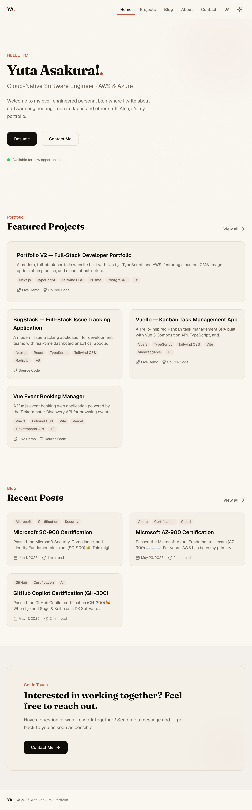

---

#### Projects — grid, detail page, and image gallery

The `/projects` page renders a searchable, filterable grid. URL-synced state (`?q=`,
`?tag=`, `?sort=`) lets the browser back-button and link-sharing work correctly. Each
project card links to a detail page that includes a full description, tech-tag list,
live and repo links, and an optional lightbox image gallery (`yet-another-react-lightbox`)
organized into named groups. Images are stored in S3 and served through CloudFront as
Sharp-generated WebP.

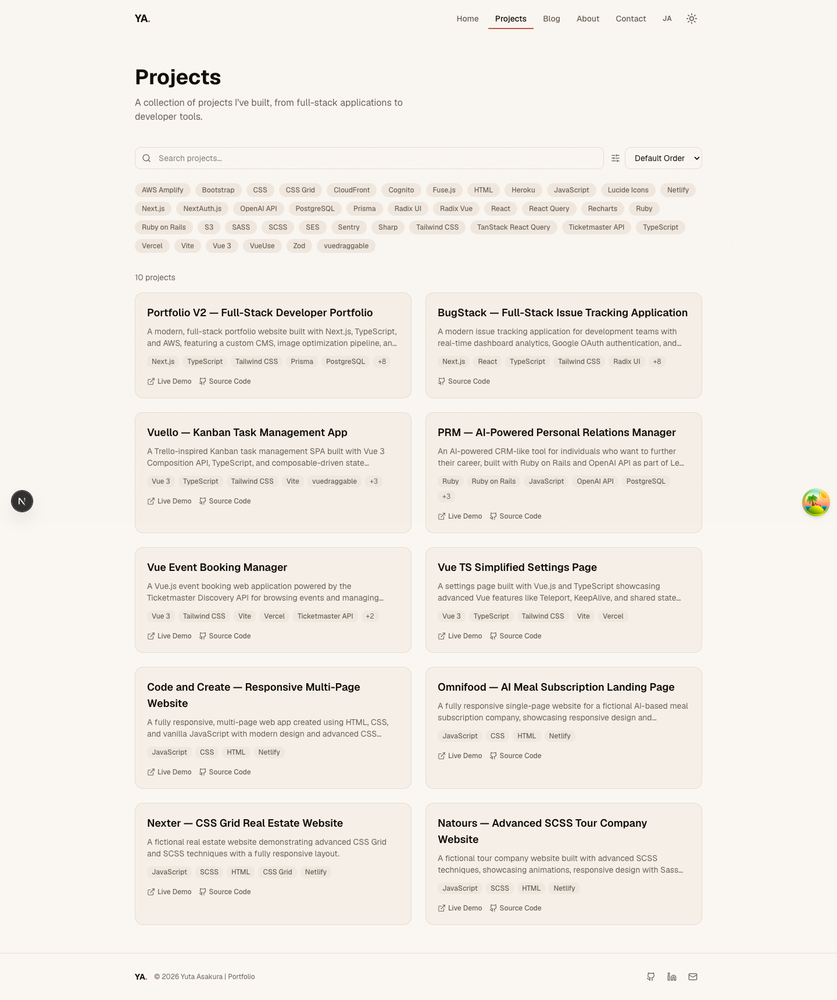

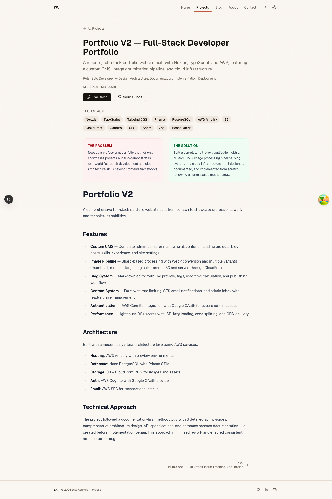

---

#### Blog — markdown rendering, table of contents, reading time, and social share

The `/blog` page is a searchable, sortable list. Each post is authored in GitHub-Flavoured
Markdown (GFM), processed by a remark/rehype pipeline (`remark-gfm`, `rehype-sanitize`,
`rehype-slug`, `rehype-highlight`), and rendered as sanitized HTML with syntax-highlighted
code blocks.

Post detail pages include:

- **Estimated reading time** — derived from word count and stored on the post record.
- **Table of contents** — auto-generated from headings using `github-slugger` to match
  `rehype-slug` IDs. Rendered as a sticky sidebar on desktop and a collapsible panel on
  mobile; appears only when the post has two or more headings.
- **Social share buttons** — one-click sharing to LinkedIn, Facebook, and X (Twitter),
  plus a copy-link button backed by the Clipboard API with a Sonner toast confirmation.

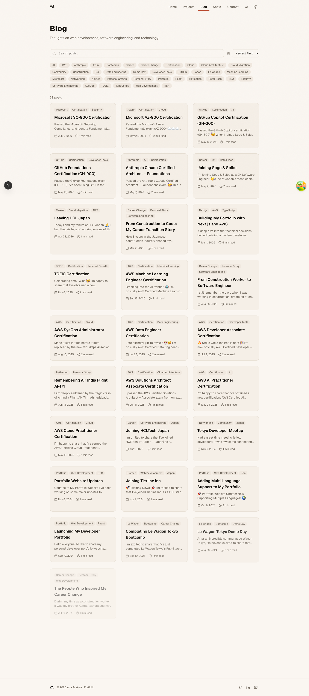

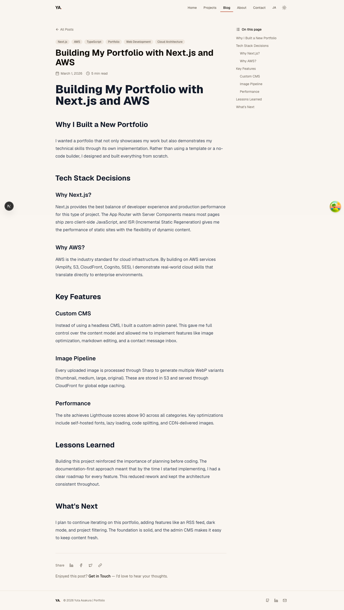

---

#### About — experience, education, skills, and certifications

The `/about` page consolidates four resume sections sourced from the database:

- **Experience** — job history with company, role, date range, and rich description.
- **Education** — institutions, degrees, and dates.
- **Skills** — grouped by category with proficiency indication.
- **Certifications** — badge images, issuer, credential ID, issue/expiration dates, and
  links to verification URLs. Expired certifications are visually flagged.

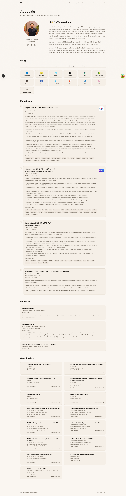

---

#### Contact form

The `/contact` page provides a name, email, subject, and message form built with
`react-hook-form` + Zod validation. Submissions are rate-limited (Upstash Redis) and
delivered via AWS SES. The form handles success, error, 429 (rate-limit), and network
failure states with appropriate inline feedback.

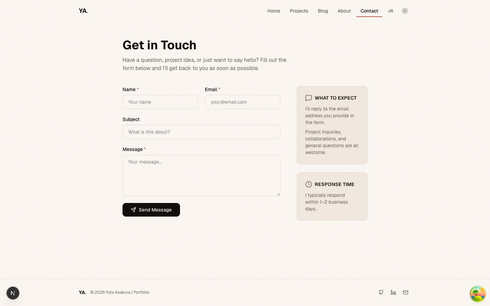

---

#### EN / JA language toggle and dark mode

A **language toggle** in the site header switches between English and Japanese (`EN` / `JA`)
with no page reload. The chosen locale is persisted to `localStorage` via the `LocaleProvider`
context. All content fields that carry a `*Ja` database column — hero, about, projects, blog
posts, experience, and education — render the appropriate locale value through the `t()`,
`tArray()`, and `tJson()` helpers. Static UI strings are stored in the `UI_STRINGS` map in
`src/lib/i18n.ts` and accessed via `ui(locale, "key")`.

**Dark mode** is wired via `next-themes`. The theme toggle in the header switches between
light and dark using CSS custom properties defined in `globals.css`.

---

#### SEO

Every page includes:

- `<JsonLd>` component injecting `application/ld+json` structured data (Person, BlogPosting,
  WebSite schemas as appropriate).
- Open Graph and Twitter card meta tags generated from page-level data.
- A `<BreadcrumbJsonLd>` component on detail pages.
- A Next.js-generated `sitemap.xml` and `robots.txt`.

---

### [Admin CMS](#admin-cms) {#admin-cms}

The admin interface lives under `/admin` and is protected by an AWS Cognito Hosted UI OAuth
flow. An `HTTP-only` cookie carries the JWT, and `src/proxy.ts` guards every `/admin` route
at the edge. The CMS is a React Query–backed SPA shell (no full-page navigations after
login) built from shadcn/Radix UI components.

---

#### Dashboard

The dashboard (`/admin`) aggregates site health at a glance across several widgets:

- **Stats cards** — projects (published / draft counts), blog posts, messages (unread /
  archived), and skills (experience + education + certification counts).
- **Content completeness** — checklist showing which sections (hero, about, projects, blog,
  skills, experience, education, certifications) have at least one published record.
- **Translation status** — per-entity Japanese coverage shown as a progress percentage,
  with a direct link to the translations page.
- **External services** — four live-status cards polled from
  `/api/admin/dashboard-external`: Sentry error count, Amplify build status, site health,
  and Google Analytics configuration.
- **Recent activity** and **recent messages** panels surface the latest content changes and
  inbound contact submissions.

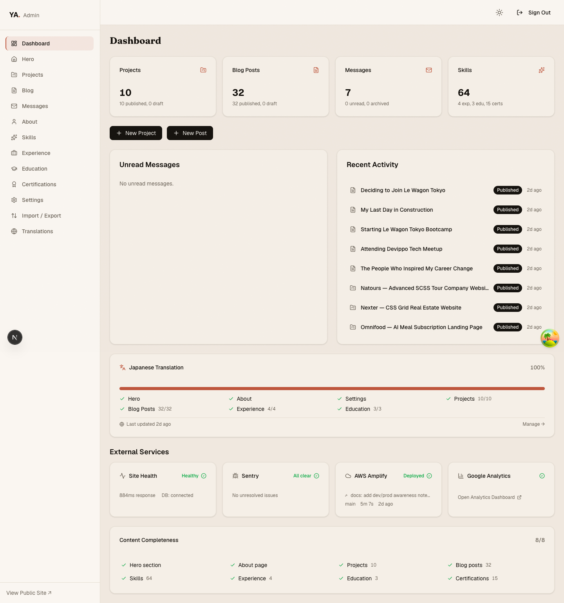

---

#### Per-entity managers

Each content type has a dedicated management page with create, edit, and delete operations:

| Entity         | Admin route             |
| -------------- | ----------------------- |
| Hero           | `/admin/hero`           |
| About          | `/admin/about`          |
| Projects       | `/admin/projects`       |
| Blog posts     | `/admin/blog`           |
| Experience     | `/admin/experience`     |
| Education      | `/admin/education`      |
| Skills         | `/admin/skills`         |
| Certifications | `/admin/certifications` |
| Messages       | `/admin/messages`       |
| Settings       | `/admin/settings`       |

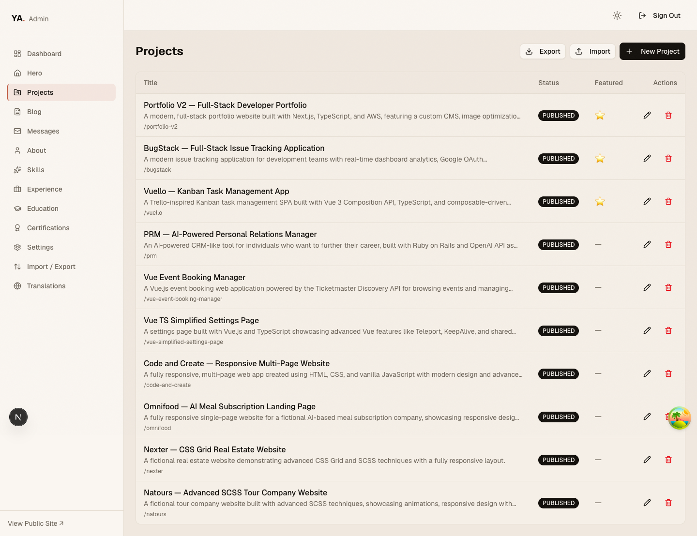

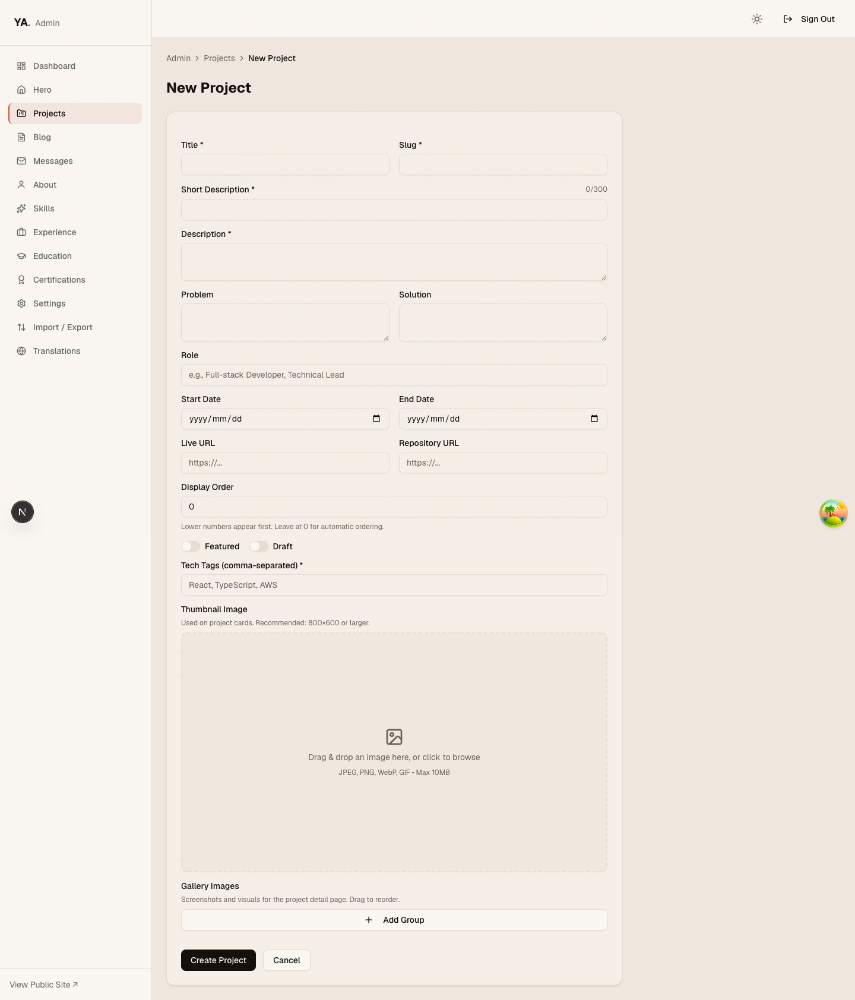

---

#### Drag-to-reorder

All list entities (projects, experience, education, skills, certifications) support
drag-to-reorder via `@dnd-kit/sortable`. Each row exposes a `GripVertical` handle;
dragging it updates `displayOrder` optimistically and persists to the server via a
dedicated reorder API endpoint.

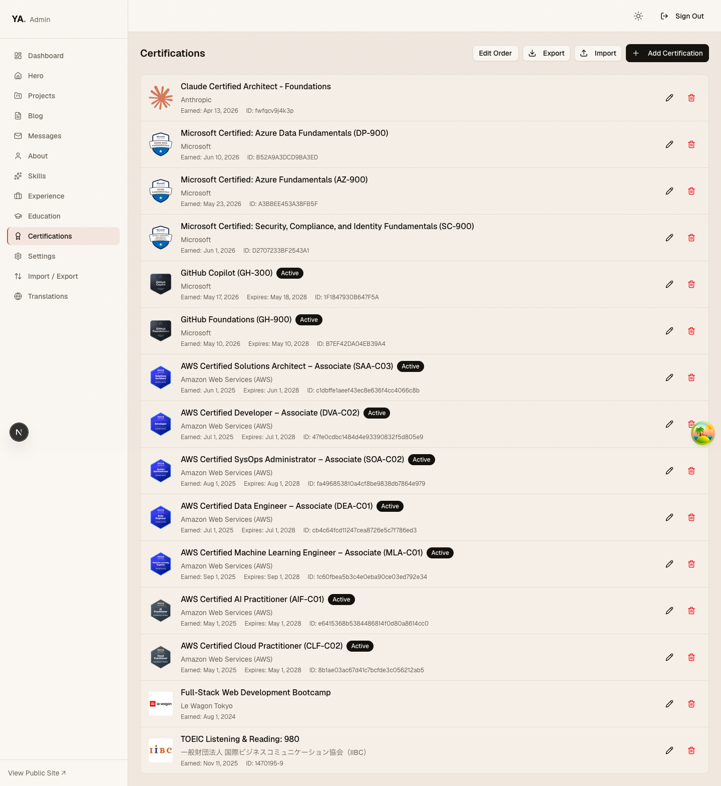

---

#### Markdown editor for blog posts

The blog post editor (`/admin/blog/new`, `/admin/blog/[id]/edit`) includes:

- `@uiw/react-md-editor` with split-pane preview.
- Tag input with free-form tag creation.
- Cover image upload (Sharp → WebP, stored in S3, served via CloudFront).
- Slug auto-generation from the title.
- Reading time auto-calculation on save.
- Draft / Published status toggle.

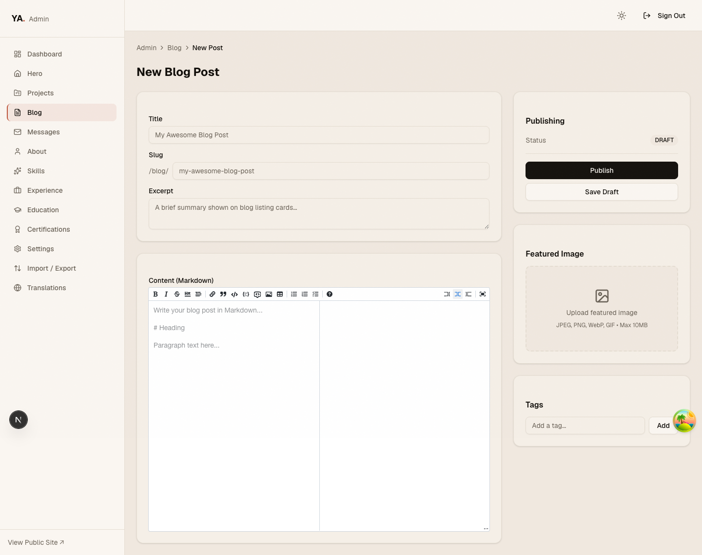

---

#### Unified import / export

Every entity manager includes an `ImportExportToolbar` with:

- **Export** to CSV and/or JSON (per-entity format list from `entityConfigs`).
- **Import** from CSV or JSON via a drag-and-drop dialog. Rows are validated against the
  entity's Zod create schema before any database write; validation errors are reported
  per-row in the UI.
- A unified full-site backup/restore endpoint (`/api/admin/export/unified` and
  `/api/admin/import/unified`) that serializes or restores all entities in dependency order.

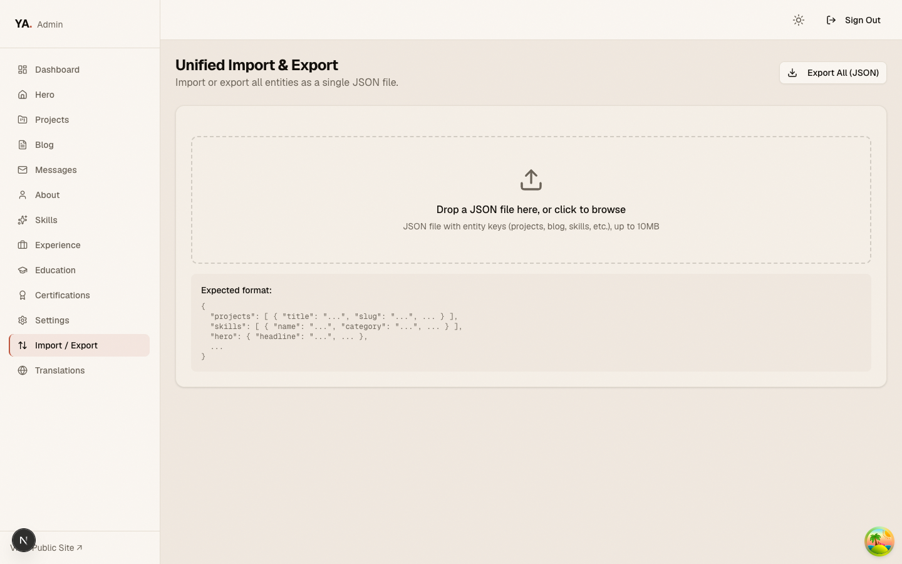

---

#### Translations page

`/admin/translations` offers a one-click "Update Japanese" workflow. It calls the
translation API (`GET /api/admin/translate` for a plan, `POST /api/admin/translate` for
execution) which uses Claude Haiku (`claude-haiku-4-5`) to translate untranslated EN
content to JA item by item. Prompt caching (`cache_control: { type: "ephemeral" }`) is
enabled on the system prompt so sequential calls within a five-minute window are served at
cached input pricing. Progress is shown per entity.

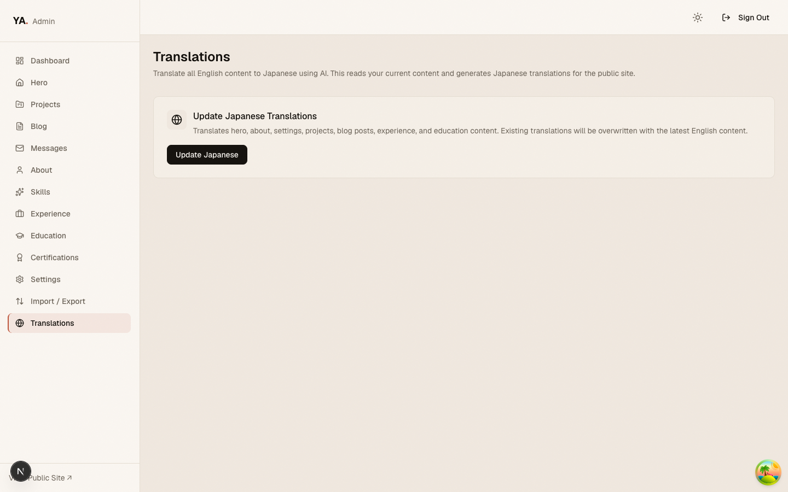

---

#### AI certificate extraction

When uploading a certification's certificate image, the form immediately calls
`/api/admin/certifications/extract` with the uploaded image URL. Claude Haiku's vision
capability reads the certificate and auto-fills the name, issuer, issue date, expiration
date, and credential ID fields. The admin can review and correct the extracted values
before saving. If extraction fails, a toast prompts the user to fill the fields manually.

